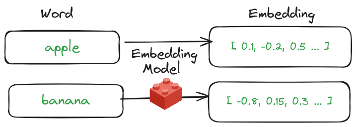
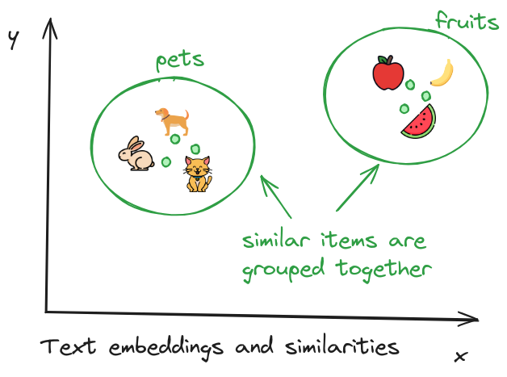
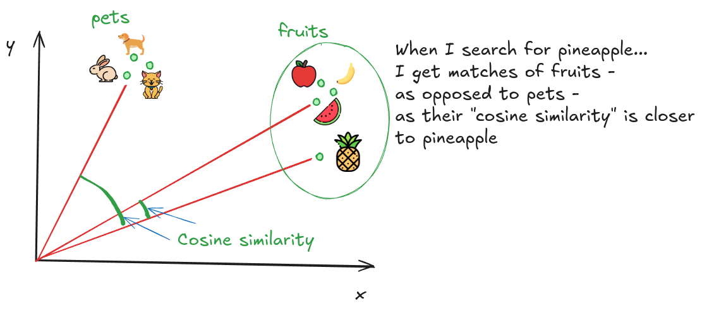

# Embeddings

## Embeddings Explained

## Tensorflow Projector

Play with embeddings.

https://projector.tensorflow.org/

## Embedding Models

See hugging face embedding models (sentence transformers) here : https://huggingface.co/models?library=sentence-transformers&sort=trending

Here are a select models for comparison.  Taken from leaderboard : https://huggingface.co/spaces/mteb/leaderboard

| model name                              | overall score | model size | model params | embedding length | License  | url                                                            |
|-----------------------------------------|---------------|------------|--------------|------------------|----------|----------------------------------------------------------------|
| intfloat/e5-mistral-7b-instruct         | 66.x          | 15 GB      | 7.11 B       | 4096             | MIT      | https://huggingface.co/intfloat/e5-mistral-7b-instruct         |
| BAAI/bge-large-en-v1.5                  | 64.x          | 1.34 GB    | 335 M        | 1024             | MIT      | https://huggingface.co/BAAI/bge-large-en-v1.5                  |
| BAAI/bge-small-en-v1.5                  | 62.x          | 133 MB     | 33.5 M       | 384              | MIT      | https://huggingface.co/BAAI/bge-small-en-v1.5                  |
| sentence-transformers/all-mpnet-base-v2 | 57.8          | 438 MB     |              | 768              | Apache 2 | https://huggingface.co/sentence-transformers/all-mpnet-base-v2 |
| sentence-transformers/all-MiniLM-L12-v2 | 56.x          | 134 MB     |              | 384              | Apache 2 | https://huggingface.co/sentence-transformers/all-MiniLM-L12-v2 |
| sentence-transformers/all-MiniLM-L6-v2  | 56.x          | 91 MB      |              | 384              | Apache 2 | https://huggingface.co/sentence-transformers/all-MiniLM-L6-v2  |

## Create Embeddings

[Run embedding models locally](./embeddings-local.ipynb)

[Use OpenAI embedding model]()

## Benchmark

Benchmarks are fun way to evalute the performance of embedding models.

Here we use Python's `%timeit` command.  it runs the code a few times and calcualtes the average.

The following code block will calculate benchmark numbers.

Here are the benchmark numbers for encoding "Hello World" on my desktop 
- Ubuntu 22.04 with Nvidia CUDA drivers (Driver Version: 525.147.05   CUDA Version: 12.0)
- Intel 8 core CPU @ 3.6 GHZ
- 32 GB Memory
- Nvidia GEFORCE 2070 with 8 GB memory

As you can see, larger models tend take longer to execute.

You can also see GPU can really accelerate execution time!

At the end, it is a trade off between **accuracy and performancee**

| Model                                   | model size | embedding length | Execution time in ms (with GPU) | Execution time in ms (without GPU) |
|-----------------------------------------|------------|------------------|---------------------------------|------------------------------------|
| BAAI/bge-large-en-v1.5                  | 1.34 GB    | 1024             | 12.5                            | 67.7                               |
| BAAI/bge-small-en-v1.5                  | 133 MB     | 384              | 6.5                             | 9.4                                |
| sentence-transformers/all-mpnet-base-v2 | 438 MB     | 768              | 6.65                            | 20.5                               |
| sentence-transformers/all-MiniLM-L12-v2 | 134 MB     | 384              | 6.74                            | 9.4                                |
| sentence-transformers/all-MiniLM-L6-v2  | 91 MB      | 384              | 3.68                            | 4.8                                |
