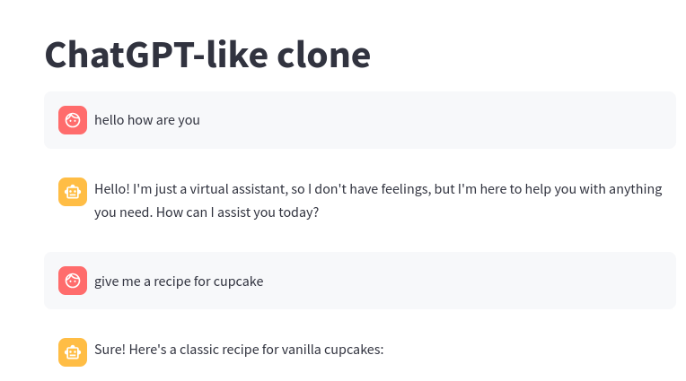

# Build and Deploy LLM Apps

We will build, package and deploy a sample LLM app

We will use [streamlit](https://streamlit.io/) framework to build nice, easy UIs

## 1 - Inspect the Code

Using Replicate [chat_app1_replicate.py](chat_app1_replicate.py)

Using OpenAI [chat_app1_openai.py](chat_app1_openai.py)

## 2 - Launch app

### 2.1 - Replicate

```bash
streamlit  run chat_app1_replicate.py
```

### 2.2 - OpenAI

```bash
streamlit  run chat_app1_openai.py
```

This will open a browser.  Or go to the default url: http://localhost:8501


## 3 - Containerize the app

For this step, you will need to have [Docker](https://www.docker.com/) installed and setup on your machine.

### 3.1 - Env file

Copy the `.env` file from project directory to this directory.  You may use a file manager / editor to do this.

Here is how to do it in terminal 

```bash
cd  llm-workshop

cp   .env    llm-apps/.env
```


### 3.2 - Build Docker

```bash
docker build .  -t llm-app
```

You can check the docker image details as follows

```bash
docker  images | grep llm
```

output may look like

```text
REPOSITORY              TAG             IMAGE ID       CREATED         SIZE
llm-app                       latest               6c85f9a56c2f   16 seconds ago   1.54GB
```

## 4 -  Running the Docker


```bash
docker run  -p 8501:8501 llm-app
```

This will start the app.  You can access the UI here :   http://localhost:8501

Here is the screenshot fo the application



## (Optional) Bonus lab 1 : Update the Example to use Ollama

Make a copy of `chat_app1_replicate.py` and modify it to use local Ollama server.

## (Optional) Bonus lab 2: Deploy the Container

Now the app if fully containerized, it can be deployed at any Cloud / Container service.

You can publish the image to Dockerhub or other cloud container repos.

And deploy from there.