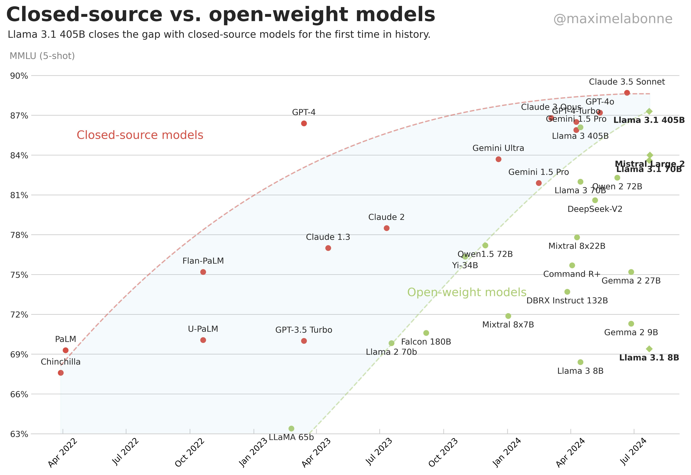

# Large Language Models (LLMs): A Primer

**What are they?**

* Sophisticated AI systems trained on vast amounts of text data.
* Capable of understanding and generating human-like text with impressive fluency and accuracy.

**Key Characteristics:**

* **Massive Scale:** Trained on datasets containing billions, even trillions, of words.
* **Deep Learning:** Utilize complex neural network architectures to learn patterns and relationships within language.
* **Generative Capabilities:** Can produce new text, translate languages, write different kinds of creative content, and answer your questions in an informative way.

**Applications:**

* **Natural Language Processing (NLP):** Chatbots, virtual assistants, machine translation, text summarization.
* **Content Creation:** Writing articles, stories, poems, even code.
* **Education:** Personalized learning, automated essay grading, research assistance.
* **Customer Service:** Answering queries, resolving issues, providing support.

**Ethical Considerations:**

* **Bias:** LLMs can reflect biases present in the training data, leading to unfair or discriminatory outputs.
* **Misinformation:** Potential for generating false or misleading information.
* **Job displacement:** Automation of tasks previously performed by humans.

**The Future of LLMs:**

* Continued advancements in model size and performance.
* Development of more specialized LLMs for specific domains.
* Increasing focus on addressing ethical concerns and ensuring responsible use.

## LLM Models

| Year       | Model             | By         | Access                   | Input        | Parameters              | Tokens in training data | Input tokens limit       | Best for                                                | Description                                                         |     |
| ---------- | ----------------- | ---------- | ------------------------ | ------------ | ----------------------- | ----------------------- | ------------------------ | ------------------------------------------------------- | ------------------------------------------------------------------- | --- |
| 2020 June  | GPT-3             | OpenAI     | API access only          |              | 175 billion             | 499 billion             |                          |                                                         |                                                                     |     |
| 2021 Oct   | Megatron (MT-NLG) | Nvidia     |                          |              | 530 billion             | 270 billion             |                          |                                                         |                                                                     |     |
| 2022 Apr   | PaLM              | Goole      | API access only          |              | 540 billion             |                         |                          |                                                         |                                                                     |     |
| 2022 Sept  | Mistral 7B        | Mistral AI | Open Source (Apache 2.0) |              |                         |                         |                          | self-hosted model for commercial and research purposes  | Mistral is a 7.3B that outperforms Llama2 (13B!)                    |     |
| 2022 Nov   | BLOOM             | BigScience | Open source              |              | 176 billion             |                         |                          |                                                         | generates text in 46 natural languages and 13 programming languages |     |
| 2022 Nov   | **chatGPT 3.5**   | OpenAI     | API access only          |              | 20 billion              |                         |                          |                                                         |                                                                     |     |
| 2023 Feb   | LLaMA             |            | Downloadable             |              | 7 billion to 65 billion |                         | 4k                       |                                                         |                                                                     |     |
| 2023 March | Claude            | Anthropic  | API access only          |              |                         |                         |                          |                                                         |                                                                     |     |
| 2023 March | Alpaca            | Stanford   | Open source              |              | 7 Billion               |                         |                          |                                                         | fine-tuned from Meta’s LLaMA 7B model                               |     |
| 2023 March | GPT 4             | OpenAI     | API access only          |              | Unknown                 | 1.76 Trillion ???       | 32k (50 pages of text)   | Fully hosted API based LLM                              | Latest and most powerful.  Can handle text and images.              |     |
| 2023 July  | LLaMA 2           | Meta       | Open source              | text         | 7B to 70B               | 2 trillion              | 4k                       | fine-tune for commercial and research purposes          |                                                                     |     |
| 2023 Oct   | GPT 4 Turbo       | OpenAI     | API access only          |              |                         |                         | 128k (300 pages of text) | A better, cheaper model than GPT 4 . gpt-4-1106-preview | training date: Apr 2023.                                            |     |
| 2023 Oct   | GPT 3.5 Turbo     | OpenAI     | API access only          |              |                         |                         | 16k                      |                                                         |                                                                     |     |
|            |                   |            |                          |              |                         |                         |                          |                                                         |                                                                     |     |
| 2024 May   | GPT 4o (omni)     | OpenAi     | API access only          | text, images | 1.8 T (?)               |                         |                          |                                                         |                                                                     |     |
| 2024 July  | Lllama 3.1        | Meta       | Open source              | text         | 405 B                   |                         |                          |                                                         |                                                                     |     |
| 2024 Sept  | Llama 3.2         | Meta       | Open source              | multi        | 1B, 3B, 11B, 90B        |                         |                          |                                                         |                                                                     |     |

References
- https://vectara.com/top-large-language-models-llms-gpt-4-llama-gato-bloom-and-when-to-choose-one-over-the-other/
