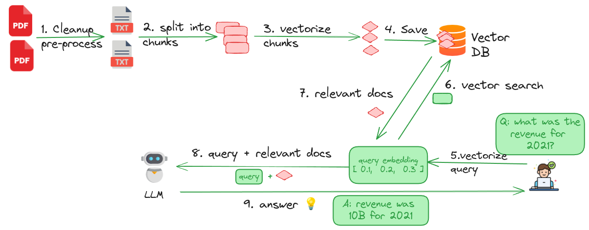

# RAG (Retrieval-Augmented Generation)

In this lab, we will process PDF documents and ask questions about them using an LLM.

We have a variety of [datasets](../data/) we can use.

## Step-1: RAG Workflow Explained

Here is the overall work flow.  For details see [RAG-explained](./RAG-explained.md)

## Step-2: Process Files

In this step: 

- we will parse PDF documents
- break them into chunks
- calculate embeddings for them
- store them into vector database

Code: [rag_1_process_documents.ipynb](rag_1_process_documents.ipynb)

## Step-3: Query Files

In this step: 

- We will ask questions of our LLM about our documents

Code: [rag_2_query_documents.ipynb](rag_2_query_documents.ipynb)

## Step-4: (Bonus Lab) - Try different documents

Bring your own PDF files.

Process them and ask questions about the files!

Share your findings with the group

## Step-5: (Bonus Lab) - Create a UI to chat with documents

You can use the example from [../llm-apps/](../llm-apps/) to create a UI chatbot for RAG